# Renewable Energy Source 
 Exploring Tableau

Energy is a fundamental input for practically all activities and, as a result, is critical for enhancing one's quality of life. Its widespread use in fields such as industry, commerce, transportation, telecommunications, agriculture, and household services has obliged us to focus our efforts on ensuring its continuous supply to satisfy our ever-increasing needs. The diverse geographies and sectors of different states in the United States have an impact on energy use and production. Many components of energy policy in the United States are decentralized to the state level. The Western Interstate Energy Compact (WIEC) was created in 1970 by 12 western states in the United States. Its purpose was to facilitate collaboration between these states in the development and management of nuclear energy technologies. An interstate compact is a legal agreement between two or more states to agree on a certain policy issue and either adopt a set of standards or cooperate on a regional or national level.

Energy-related issues are not a recent phenomena. Energy-related issues have been around for over 2500 years. Considering wood was their primary source of energy, the early Romans and Greeks suffered a fuel scarcity. They had to import timber from distant locations. The primary source of energy is still fossil fuels. The use of oil and gas is at an all-time high right now. Fossil fuel resources formed over millions of years and are limitless. The primary challenges with the energy crisis are: how to use energy from non-renewable sources as efficiently as possible; and What are the best ways to use renewable or alternative energy sources? 

 
<h2>Problem Statement:</h2>

To conduct a data analysis of interstate energy usage and production in the United States for the four states along the Mexican border – California (CA), Arizona (AZ), New Mexico (NM), and Texas (TX) as shown in Figure1 – that want to form a realistic new energy compact focusing on increased use of cleaner, renewable energy sources.

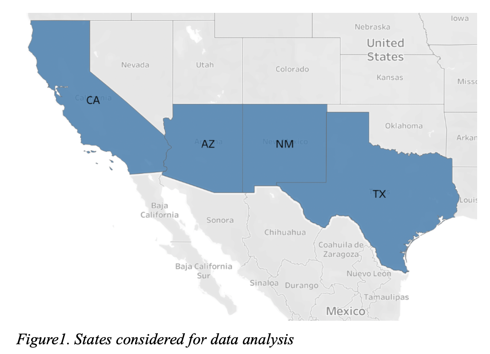

<h2>Data Description:</h2>

The dataset provides 50 years of data with 585 variabl;es on each of the four states’ energy production and consumption along with some demographic and economic information. The given dataset describes consumption, production, and cost of energy in four Southwest states. The eight primary energy sources that contribute to total energy consumption are Coal, Natural Gas, Petroleum Products, Fuel Ethanol, Geothermal, Hydroelectric, Solar, and Wind. The first three are non-renewable and contribute to climate change.

<h2>Energy profile:</h2>

Total energy consumption is defined as the sum of non-renewable and renewable energy in the given data. We chose total consumption of all energy-consuming sectors in BTUs (British Thermal Units) for the energy profiles . Figure 2 shows the energy profiles for Arizona, California, New Mexico, and Texas in 2009. We chose to represent the energy profiles as pie charts and side-by-side bar charts since they are simple to judge and interpret.

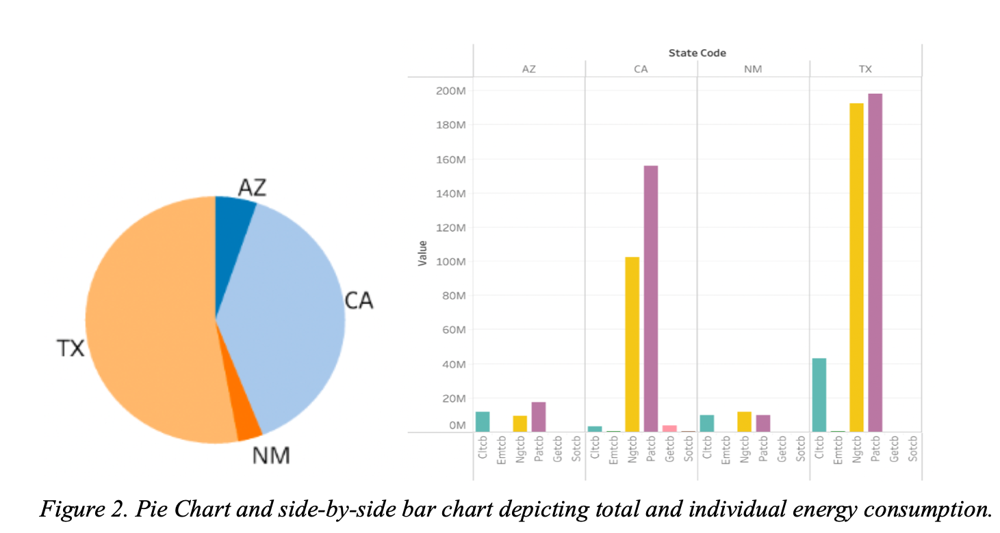

The side-by-side bar chart depicts the total consumption of 3 renewable and 3 non-renewable energy such as Coal, Natural gas, Petroleum products, Fuel Ethanol, Geothermal and solar in all four states.

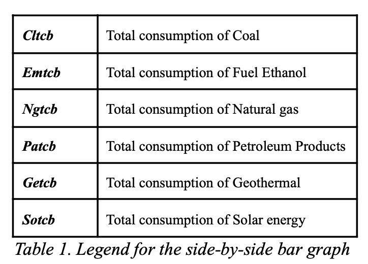
<h2>Renewable energy Production and Consumption:</h2>

Renewable energies are, as the name implies, renewable, but non-renewable energies are not, allowing renewable energy to provide energy long after non-renewable sources have ceased to be viable sources of energy. Non-renewable energy is limited in supply on Earth, and as it is utilized, the supply depletes until it is exhausted to the point that it is no longer available.

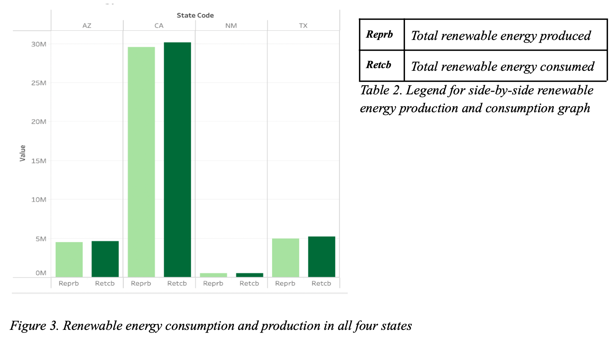

Renewable energy sources, such as solar energy, will last as long as humans, which implies that consumers and industries can use them endlessly without fear of environmental damage or resource scarcity. Figure 3 shows that practically all of the renewable energy generated is consumed by all of the states. Also, when compared to the other four states, California uses the most renewable energy, followed by Texas, Arizona, and New Mexico. The use of a side-by-side bar chart to represent renewable energy usage because the relative lengths of the bars provide a clear picture of how it is being used.

<h2>The “best” profile out of all four states in 2009:</h2>

All of the renewable energy produced is consumed by all of the states, as shown in Figure 3. Figure 4 compares total energy consumption and renewable energy consumption for each state to determine which state has the best profile in the year 2009.

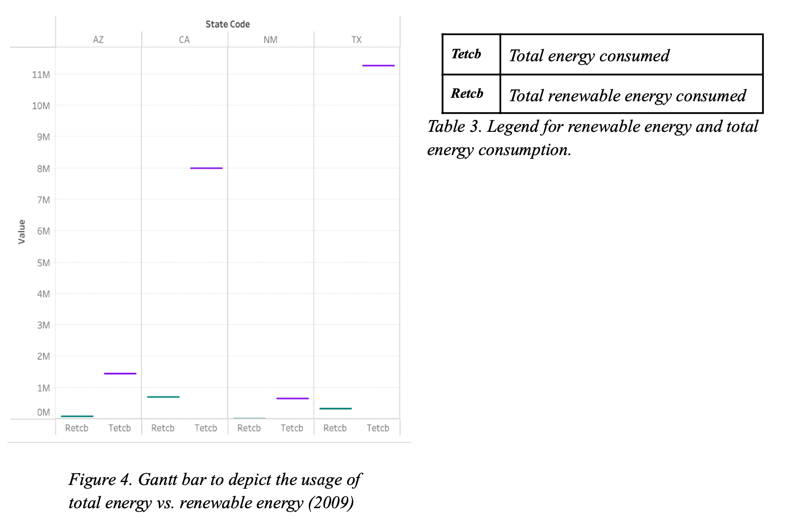

Texas has definitely consumed more energy overall than the other states, with California, Arizona, and New Mexico following closely after. California uses the most renewable energy, followed by Arizona, Texas, and New Mexico, in terms of overall energy consumption. This means that California uses less nonrenewable energy than the other states, whereas Texas uses the most.

Thus we can say that <b><u>California has the best profile in 2009</u></b>for the use of renewable energy followed by Arizona, Texas, and New Mexico.

<h2>Sector-wise energy consumption:</h2>
For each of the four states outlined, four different sorts of sectors are defined which are transportation, commercial, industrial and residential.
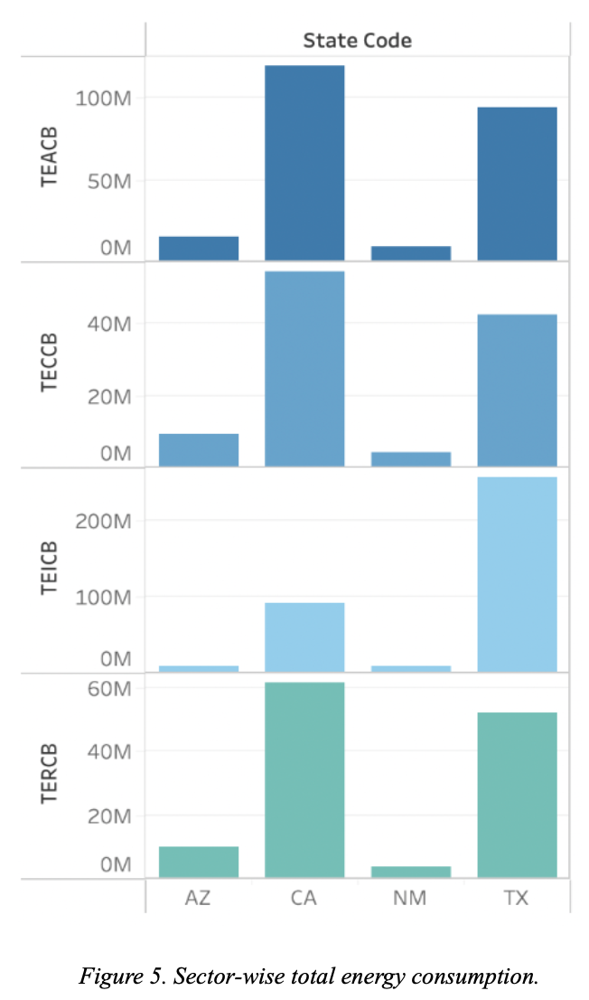

Comparatively, the industrial sector has consumed less energy for all the states except for Texas. We can also say that, regardless of the state, all sectors consumed relatively similar amounts of energy.

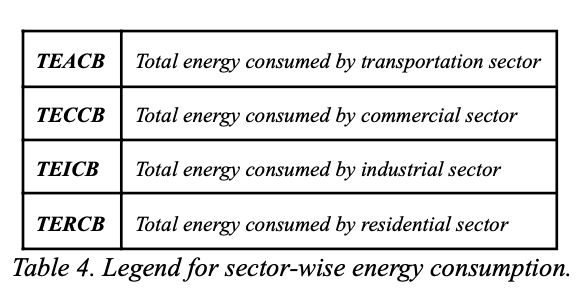

Although Texas has consumed more energy in the industrial sector, California has consumed more energy in the transportation, commercial, and residential sectors than the other states. New Mexico uses the least amount of energy of all the states. In the industrial sector, Arizona is comparable to New Mexico, but it outperforms it in the other three sectors.

<h2>Types energy consumption in each sector:</h2>
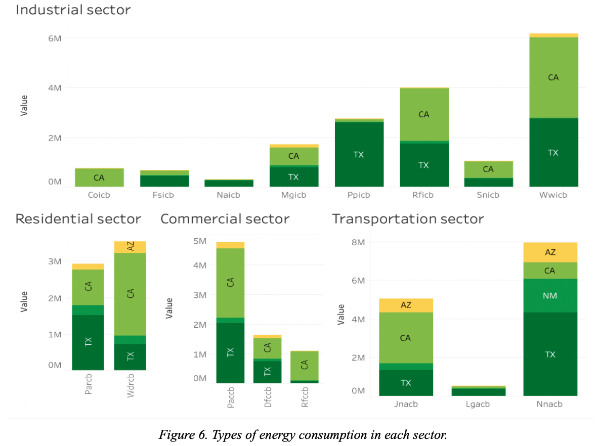

Figure 6 shows the graphical representation of all the types of energies used by each sector. Table 5 gives the list of all the types of energies that are plotted in the graph. From these visualizations we can say that the industrial sector uses more energy sources compared to others.

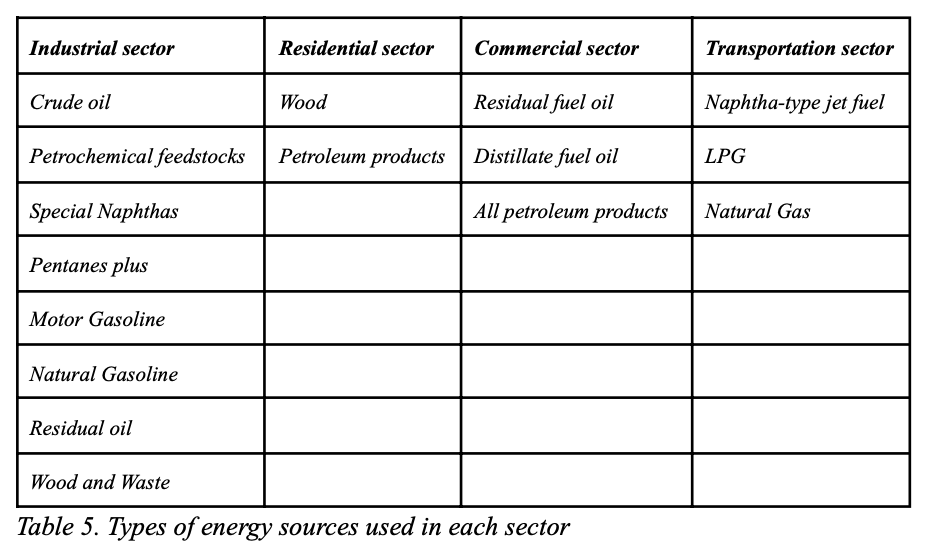

<h2>Electricity produced:</h2>
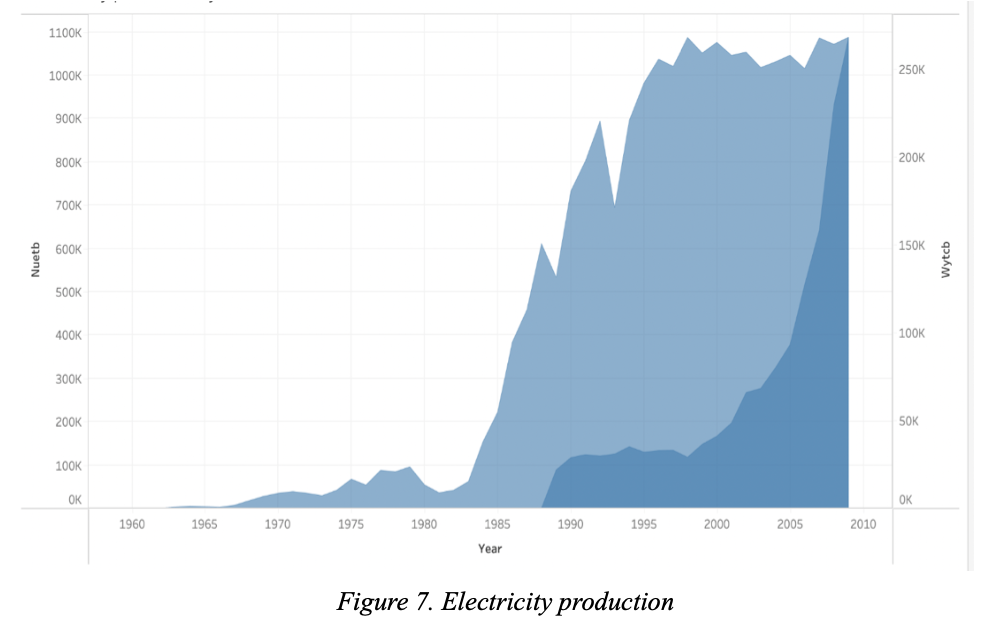

Renewable and non-renewable energy sources, such as wind and nuclear power, are used to generate electricity. Figure 7 shows that electricity is generated primarily from nuclear power at first, but that electricity generated from wind power improves after 1988. In 2009, both were nearly equivalent.

<h2>Total consumption of kerosene and Aviation gasoline:</h2>

Treemaps and Bubble charts are used to depict the amount of kerosene and aviation gasoline consumed by each state because it is easier to see which state consumes the most by looking at the area. Figure 8 shows that Texas uses more kerosene and California uses more aviation gasoline.

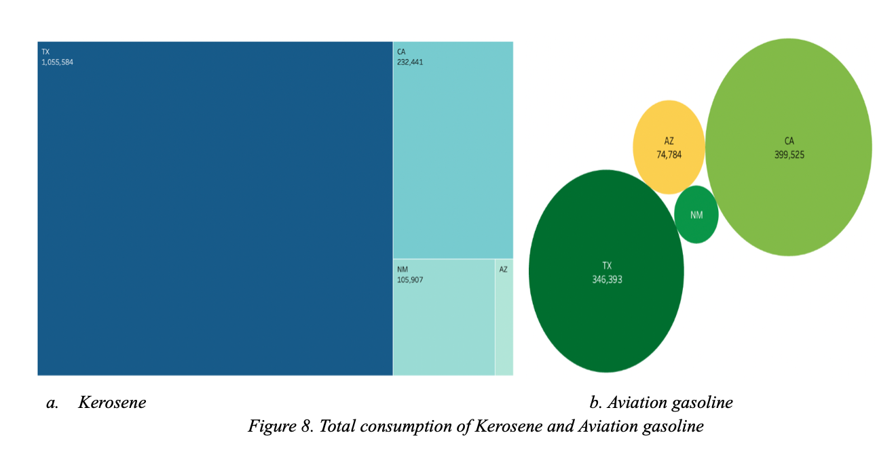

<h2>Conclusion:</h2>

Energy conservation is seen as a rapid and cost-effective solution to address the problem of power shortages while simultaneously conserving the country's finite energy resources. Energy saving solutions are cost-effective, require very minimal investments. States can increase their clean energy generation by constructing solar, wind, and geothermal farms in the most advantageous places, reducing their reliance on non-renewable resources.

The amount of energy produced initially exceeds the amount of energy consumed, but as time passes, the amount of energy consumed exceeds the amount of energy produced, as shown in figure 9 by a dual combination graph.

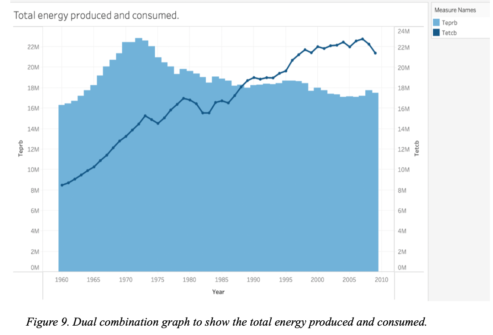

Comparing all the states, we can conclude that California has the best profile; Texas consumes more non-renewable energy; New Mexico uses less energy and Arizona has a moderate level of energy consumption.

